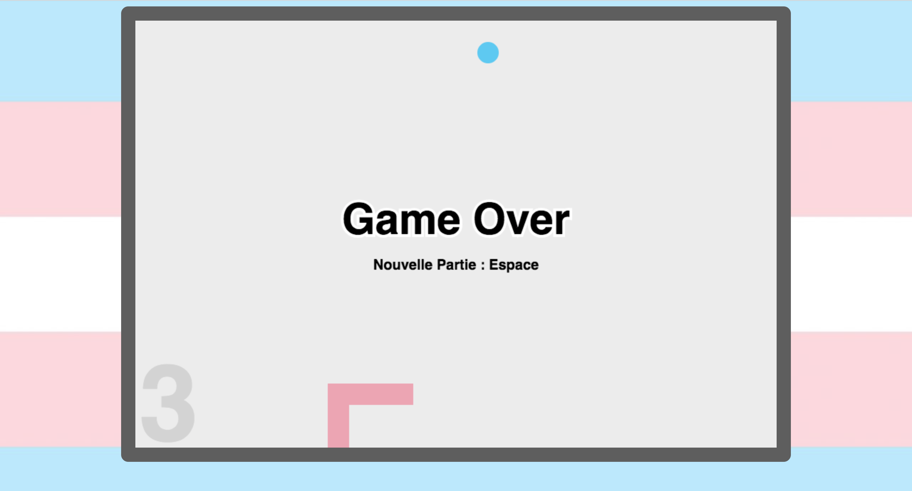

# Snake Queer - Vanilla JS
## Famous snake game with trans flag colors :)
[Démo du Snake ici](https://shayreichert.github.io/snake_trans/)

## Built With

* [Vanilla JS](http://vanilla-js.com/) - The best JS framework

////////
MEMO pour lancer Sass depuis son éditeur de code :

- Créer un package.json : npm init
(- Installer Sass si nécessaire : npm install sass -g puis sass --version)

- Ajouter un script Sass au .json :
"scripts": {
  "sass": "sass --watch ./css/style.scss:./css/style.css"
},

- Enregistrer le .json, puis lancer Sass :
npm run sass
